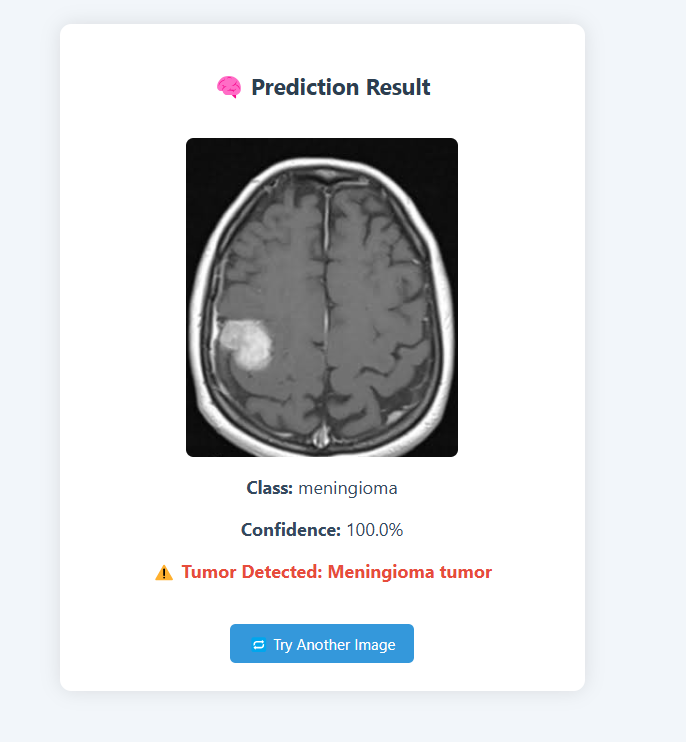

# 🧠 Brain Tumor Detection using CNN

A deep learning-based web app that detects brain tumors from MRI scans using a Convolutional Neural Network (CNN). Built with **TensorFlow** and deployed using **Flask**.

---

## 🚀 Demo

Upload an MRI image and get instant predictions.  
👇 Here's how it looks:



---

---

## 🧪 Training Summary

| Metric              | Score     |
|---------------------|-----------|
| Training Accuracy   | ✅ 98.6%   |
| Validation Accuracy | ✅ 96.3%   |
| Loss                | 📉 0.054   |

Model Architecture:
- 2D Convolution Layers + ReLU
- Max Pooling
- Dropout Regularization
- Fully Connected Dense Layers
- Softmax Output Layer

---

## 🧠 Tumor Classes Detected

- Glioma Tumor
- Meningioma Tumor
- Pituitary Tumor
- **No Tumor**

> 🟢 If `No Tumor` is predicted:  
> ✅ **No tumor in brain detected.**

> 🔴 Otherwise:  
> ⚠️ **Tumor detected:** _{Tumor Type}_

---


## 📁 Project Structure

📁 Brain-Tumor-Detection-using-CNN/
├── app.py                  # Flask web app
├── predict.py              # Prediction logic (image preprocessing + model inference)
├── model/
│   └── saved_model/        # Trained CNN model (excluded from repo due to size)
├── static/
│   ├── uploads/            # Folder to store uploaded MRI scans
│   └── demo/               # Demo image used in README
├── templates/
│   ├── index.html          # Upload interface
│   └── result.html         # Prediction results display
├── requirements.txt        # Python dependencies
└── README.md               # You're here!

---

## 💻 Setup Instructions

### 1. Clone the Repository

## 🛠️ Setup Instructions

### 1. Clone the Repository

```bash
git clone https://github.com/yourusername/Brain-Tumor-Detection-using-CNN.git
cd Brain-Tumor-Detection-using-CNN
```

### 2. Install Dependencies

```bash
pip install -r requirements.txt
```

### 3. Run the Flask App

```bash
python app.py
```

### 4. Open in Browser

```bash
http://127.0.0.1:5000/
```

---

### ⚠️ Note on Model

The trained CNN model is **excluded from this repository** due to GitHub's 100MB file size limit.

➡️ Please download the model separately and place it inside the following directory:

```bash
model/saved_model/
```

---

## 🙌 Credits

- **Dataset:** Brain MRI Dataset – [Kaggle](https://www.kaggle.com/datasets/masoudnickparvar/brain-tumor-mri-dataset)
- **Frameworks Used:** TensorFlow, Keras, Flask
- **Model:** Custom CNN built for multi-class tumor detection

---

**Made with ❤️ by [Ajay Chaudhary](https://github.com/ajaychaudhary2)**
